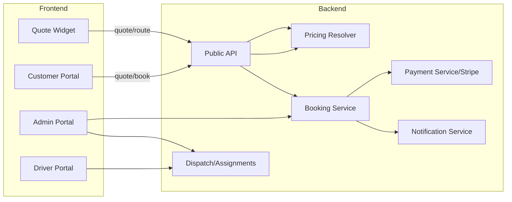
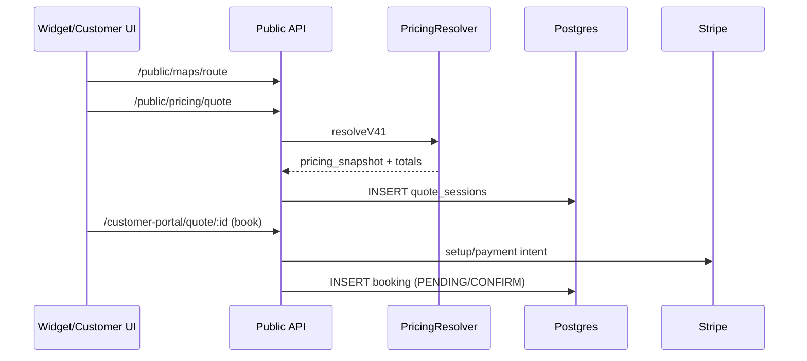
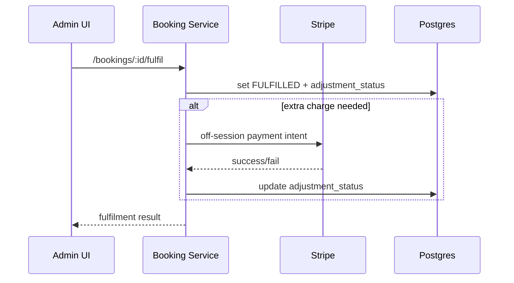

# Chauffeur‑SaaS — Codebase Audit Summary

> Purpose: persistent overview for future context recovery. Generated by OpenClaw.

## 0) Repo Structure (Monorepo)
- **Backend**: NestJS (`/src`)
- **Frontend**: Next.js App Router
  - `apps/admin` — Admin/tenant console
  - `apps/customer` — Customer portal
  - `apps/driver` — Driver portal
- **Widget**: Vite + React (`apps/quote-widget`)
- **Multi‑tenant**: `tenant_slug` + `/public/tenant-info` theme injection

---

## 1) Pricing / Quote / Discount / Surcharge
**Entry points**
- `src/pricing/pricing.resolver.ts`
- `src/public/public-pricing.service.ts`

**Two pricing paths**
- No `serviceTypeId` → legacy Zone / Itemized logic
- With `serviceTypeId` → `resolveV41`

**resolveV41 summary**
- Point‑to‑point vs Hourly are separate flows
- Return trip: leg1 + leg2 computed independently; return rule (percentage/add) applied after combining
- Toll/Parking computed per leg and summed
- Surcharge computed per leg, merged (avoid double counting)
- Baby seats & waypoints priced per leg; return can double count

**Discount layers**
1) Internal discount (PricingResolver): applies to fare + surcharge + baby seats (not toll/parking)
2) Promo/tenant discount (PublicPricingService): applied post‑total (risk: may implicitly discount toll/parking)

**Risk notes**
- Promo discount currently subtracts from `grand_total` → may violate “toll/parking not discounted” rule in `DECISIONS.md`.

---

## 2) Booking Flow (Customer + Admin)
**Customer portal**
- `apps/customer/app/quote/QuoteClient.tsx` → `/public/pricing/quote`
- `apps/customer/app/book/BookPageClient.tsx` → `/public/pricing/quote/:id`
- Stripe publishable key: env → hardcoded fallback → API `/customer-portal/stripe-config`

**Admin booking detail**
- `apps/admin/app/(tenant)/bookings/[id]/page.tsx`
- Supports: confirm / reject / confirm‑&‑charge / retry / payment modal / fulfilment

**Booking status (operational)**
- `PENDING_CUSTOMER_CONFIRMATION`
- `AWAITING_CONFIRMATION`
- `CONFIRMED`
- `PAYMENT_FAILED`
- `COMPLETED`
- `FULFILLED`
- `CANCELLED`

---

## 3) Multi‑Tenant & Branding
**Backend**
- `/public/tenant-info` returns `branding + widget_settings`
- Admin updates via `/tenant-branding`

**Frontend**
- `TenantProvider` (customer/driver) injects CSS vars (`--primary`, `--background`, `--card`, `--border`, `--font-display`, etc.)

---

## 4) Quote Widget (apps/quote-widget)
**Flow**
1. Fetch tenant info + cities + service types
2. User inputs → `/public/maps/route`
3. Quote → `/public/pricing/quote`
4. Render vehicles + Book CTA

**Return trip logic**
- Return route computed separately (reverse waypoints)
- `return_waypoints_count` sent when return trip

**UI components**
- `LuxDateTimePicker` + `DropdownPortal`
- `PlacesAutocomplete` via SaaS proxy (no Google SDK)

---

## 5) Driver & Dispatch
**Dispatch**
- `apps/admin/app/(tenant)/dispatch/page.tsx`
- `/dispatch/offer`

**Assign Driver**
- `apps/admin/components/assign-driver-modal.tsx`
- Driver pay: % or fixed; toll/parking editable
- Shows driver’s daily schedule

**Driver App**
- `/driver-app/assignments` for upcoming/past
- Driver execution status: `assigned → accepted → on_the_way → arrived → passenger_on_board → job_done`

---

## 6) Payments / Fulfil / Notifications
**Stripe**
- Webhooks in `src/payment/stripe-webhook.controller.ts`

**Fulfilment**
- `apps/admin/components/fulfil-modal.tsx`
- `/bookings/:id/fulfil-preview` + `/bookings/:id/fulfil`
- Supports extra charges based on actuals (waiting/toll/parking/waypoints)

**Driver report**
- Admin can review `driver_extra_report` before fulfil

---

## 7) Key Risks / TODO
1. Promo discount may apply to toll/parking (verify with D001)
2. `return_waypoints_count` should be validated vs backend expectations
3. Hardcoded Stripe publishable key risks in multi‑tenant
4. Return trip display logic varies across UI → confirm consistent fields

---

## 8) File Index (Quick Reference)
**Backend**
- `src/pricing/pricing.resolver.ts`
- `src/pricing/snapshot.builder.ts`
- `src/public/public-pricing.service.ts`
- `src/booking/booking.service.ts`
- `src/customer-portal/customer-portal.service.ts`
- `src/payment/payment.service.ts`
- `src/payment/stripe-webhook.controller.ts`
- `src/dispatch/dispatch.service.ts`
- `src/driver/driver-app.service.ts`
- `src/tenant/tenant.controller.ts`
- `src/public/public-tenant.service.ts`

**Admin**
- `apps/admin/app/(tenant)/bookings/[id]/page.tsx`
- `apps/admin/components/assign-driver-modal.tsx`
- `apps/admin/components/payment-modal.tsx`
- `apps/admin/components/fulfil-modal.tsx`
- `apps/admin/app/(tenant)/dispatch/page.tsx`
- `apps/admin/app/(tenant)/settings/branding/page.tsx`
- `apps/admin/app/(tenant)/settings/widget/page.tsx`

**Customer**
- `apps/customer/app/quote/QuoteClient.tsx`
- `apps/customer/app/book/BookPageClient.tsx`
- `apps/customer/app/dashboard/DashboardClient.tsx`
- `apps/customer/app/bookings/page.tsx`
- `apps/customer/app/bookings/[id]/BookingDetailClient.tsx`
- `apps/customer/components/TenantProvider.tsx`

**Driver**
- `apps/driver/app/dashboard/DashboardClient.tsx`
- `apps/driver/app/bookings/[id]/BookingDetailClient.tsx`
- `apps/driver/components/TenantProvider.tsx`

**Widget**
- `apps/quote-widget/src/Widget.tsx`
- `apps/quote-widget/src/api.ts`
- `apps/quote-widget/src/components/LuxDateTimePicker.tsx`
- `apps/quote-widget/src/components/PlacesAutocomplete.tsx`
- `apps/quote-widget/src/widgetConfig.ts`

---

## 9) Detailed Annotations (Per File)

### Backend — Pricing / Public
- `src/pricing/pricing.resolver.ts`
  - Entry point for pricing.
  - Switches to legacy logic when no `serviceTypeId`.
  - `resolveV41` handles service type pricing, return leg, surcharges, toll/parking, return rules.
- `src/pricing/snapshot.builder.ts`
  - Builds pricing snapshot used by frontends for breakdown display.
- `src/public/public-pricing.service.ts`
  - Handles `/public/pricing/quote`.
  - Adds promo/tenant discounts (potentially touching toll/parking).

### Backend — Booking / Customer Portal
- `src/booking/booking.service.ts`
  - Core booking creation/updates, status transitions, fulfilment hooks.
- `src/booking/booking.controller.ts`
  - Admin booking endpoints (cancel, charge, fulfil, etc.).
- `src/customer-portal/customer-portal.service.ts`
  - Customer booking lifecycle (quote session, create booking, dashboard).
- `src/customer-portal/customer-portal.controller.ts`
  - HTTP layer for customer portal.

### Backend — Payments / Stripe
- `src/payment/payment.service.ts`
  - Charge capture, payment intents, status updates.
- `src/payment/stripe-webhook.controller.ts`
  - Stripe webhook receiver (rawBody).

### Backend — Dispatch / Driver / Tenant
- `src/dispatch/dispatch.service.ts`
  - Offer workflow for dispatching bookings to drivers.
- `src/driver/driver-app.service.ts`
  - Driver app assignment list, detail payloads.
- `src/tenant/tenant.controller.ts`
  - Branding + settings updates per tenant.
- `src/public/public-tenant.service.ts`
  - Public tenant info for widget/portals.

---

### Admin Frontend
- `apps/admin/app/(tenant)/bookings/[id]/page.tsx`
  - Full booking detail UI.
  - Handles confirm/reject, confirm+charge, retry charge, payment modal, fulfilment, invoice resend/download.
  - Handles driver report banners (pending review vs reviewed).
- `apps/admin/components/payment-modal.tsx`
  - Actions: send pay link, charge saved card, mark paid.
- `apps/admin/components/fulfil-modal.tsx`
  - Fulfil preview + actuals (distance/duration/waiting/toll/parking) + extra charge application.
- `apps/admin/components/assign-driver-modal.tsx`
  - Assign driver + vehicle + driver pay; toll/parking passthrough; shows driver schedule.
- `apps/admin/app/(tenant)/dispatch/page.tsx`
  - Dispatch board with booking/driver/vehicle selection; `/dispatch/offer`.
- `apps/admin/app/(tenant)/settings/branding/page.tsx`
  - Branding form (logo, colors, font, domain) + HSL conversions.
- `apps/admin/app/(tenant)/settings/widget/page.tsx`
  - Widget settings toggles (return/flight/waypoints/etc.).

---

### Customer Frontend
- `apps/customer/app/quote/QuoteClient.tsx`
  - Full quote workflow (cities/service types/car types → route → quote).
  - 12‑hour minimum booking rule (urgent modal).
  - Return leg route computed separately; reverse waypoints.
  - Auto‑discount via `/public/discounts/auto`.
  - Pending quotes list for logged‑in users.
- `apps/customer/app/book/BookPageClient.tsx`
  - Loads quote session and handles Stripe setup intent.
  - Supports guest + logged‑in flows.
- `apps/customer/app/dashboard/DashboardClient.tsx`
  - Upcoming/past trips list; tenant theme injected.
- `apps/customer/app/bookings/page.tsx`
  - Bookings list (upcoming/past/all).
- `apps/customer/app/bookings/[id]/BookingDetailClient.tsx`
  - Booking details, status banners, driver status, invoice download.
- `apps/customer/components/TenantProvider.tsx`
  - Injects tenant branding to CSS variables.

---

### Driver Frontend
- `apps/driver/app/dashboard/DashboardClient.tsx`
  - Upcoming/past assignments; dark/light card variants.
- `apps/driver/app/bookings/[id]/BookingDetailClient.tsx`
  - Booking detail + driver execution status.
- `apps/driver/components/TenantProvider.tsx`
  - Same branding injection as customer.

---

### Quote Widget
- `apps/quote-widget/src/Widget.tsx`
  - Widget core flow (tenant → config → route → quote → results).
  - `widget_settings` controls field visibility.
- `apps/quote-widget/src/api.ts`
  - Fetch helpers: tenant info, cities, service types, route, quote.
- `apps/quote-widget/src/components/LuxDateTimePicker.tsx`
  - Custom date/time picker (portal positioning, fixed, viewport‑clamped).
- `apps/quote-widget/src/components/PlacesAutocomplete.tsx`
  - Autocomplete via SaaS proxy (`/public/maps/autocomplete`).
- `apps/quote-widget/src/widgetConfig.ts`
  - Widget settings defaults + merge.

---

## 10) Function‑Level Notes (Phase 1 — Pricing/Public)

### `src/pricing/pricing.resolver.ts`
- `resolveTollForRoute(tenantId, pickupAddress, dropoffAddress, currency, pickupAtUtc, enabled)`
  - Uses Google Maps route (with toll estimate) to compute `tollAmountMinor`.
  - Returns 0 if disabled or missing addresses.
- `resolveToll(ctx)`
  - Adapter to `resolveTollForRoute` using `PricingContext`.
- `resolveParkingForPickup(tenantId, pickupAddress)`
  - Uses `AirportParkingService.resolveParking` to return parking fee (minor).
- `applyMultiplier(baseMinor, type, value, surchargeMinor)`
  - If PERCENTAGE: `base * value% + surcharge`; else flat `base + surcharge`.
- `mergeReturnSurcharges(outbound, ret, combinedBaseMinor)`
  - Dedupes surcharges by (label/type/value) and re‑applies on combined base.
- `findTier(tiers, actualHours)`
  - Selects hourly tier by hours range; default is 100% if none.
- `calculateReturnableLegMinor(...)`
  - Computes leg fare = base + (km * perKm) + (min * perMin), applies multiplier + minimum + waypoint fees.
- `resolve(ctx)`
  - Main dispatcher: if `serviceTypeId` → `resolveV41`; else legacy zone/itemized flow.
  - Legacy flow: build snapshot → toll → discount → grand_total.
  - Sets `toll_minor`, `parking_minor`, `grand_total_minor`.

### `src/pricing/snapshot.builder.ts`
- `buildSnapshot(params)`
  - Sums item subtotals → applies surge multiplier → returns `PricingSnapshot`.

### `src/public/public-pricing.service.ts`
- `buildQuoteResults(tenant, dto)`
  - Loads active car types.
  - Reads `toll_enabled` + `waypoint_charge_enabled` from service type.
  - For each car type, builds `PricingContext` and calls `PricingResolver.resolve`.
  - Applies **tenant discount** via `DiscountService.resolveDiscount`.
  - Returns `pricing_snapshot_preview` with leg breakdown + discount + final fare.
- `quote(slug, dto)`
  - Resolve tenant by slug, calls `buildQuoteResults`.
  - Creates `quote_sessions` row with 30‑minute expiry.
- `getQuoteSession(quoteId)`
  - Fetches active (non‑expired) quote session.
- `markConverted(quoteId)`
  - Sets `quote_sessions.converted = true`.

---

## 11) Function‑Level Notes (Phase 2 — Booking/Customer Portal)

### `src/booking/booking.service.ts`
- `listBookings(tenantId, query)`
  - Filters by status/date/search, returns paginated list with assignment join.
- `getBookingDetail(tenantId, bookingId)`
  - Loads booking + status history + assignments + payments + saved card.
  - Includes latest driver extra report + `has_extras` flag for admin review.
- `getDriverExtraReportForAdmin(tenantId, bookingId)`
  - Dedicated admin fetch for execution report + status metadata.
- `createBooking(tenantId, dto)`
  - Builds `PricingContext` and resolves pricing.
  - Inserts booking, status history, and triggers notification.
  - Default status: `PENDING_CUSTOMER_CONFIRMATION` (sends payment link).
- `transition(bookingId, newStatus, userId, reason)`
  - Enforces transition rules (`BOOKING_TRANSITION_RULES`) unless bypassed.
  - Writes status history and fires notifications (Confirmed/Cancelled/Completed).
- `cancelBooking(tenantId, bookingId, actor)`
  - Marks booking CANCELLED, inserts history, cancels open assignments, fires notification.
- `fulfilBooking(tenantId, bookingId, adminId, body)`
  - Marks FULFILLED, sets adjustment fields, logs history.
  - Reviews driver report, attempts off‑session extra charge (ADJUSTMENT) if needed.
  - Freezes trip evidence (audit).
- `markPaid(tenantId, bookingId)`
  - Sets `payment_status = PAID`.
- `checkInvoiceGating(booking)`
  - Blocks final invoice if adjustment unresolved or tenant invoice profile incomplete.
- `resendInvoice(tenantId, bookingId)`
  - Re‑fires `InvoiceSent` for latest SENT/PAID invoice after gating check.
- `getInvoicePdfForAdmin(tenantId, bookingId)`
  - Generates PDF for latest SENT/PAID invoice.
- `sendPaymentLink(tenantId, bookingId)`
  - Generates payment token (expires at min(24h, pickup time)), sends payment link notification.
- `chargeNow(tenantId, bookingId)`
  - Captures Stripe payment for AUTHORIZED bookings via `PaymentService`.
- `confirmAndCharge(tenantId, bookingId)`
  - Off‑session Stripe charge for saved card; success → CONFIRMED/PAID; failure → PAYMENT_FAILED.
- `rejectBooking(tenantId, bookingId, actorId, reason)`
  - Cancels booking from PENDING_CUSTOMER_CONFIRMATION / AWAITING_CONFIRMATION.
- `finalizeBooking(tenantId, bookingId, adminId, body)`
  - Stores actuals from driver report; updates actual totals.
- `modifyBookingAdmin(tenantId, bookingId, adminId, dto)`
  - Admin edits allowed fields, can override total + snapshot; notifies stakeholders.
- `settleBooking(tenantId, bookingId, adminId, body)`
  - Reconciles actual vs prepay: charge extra / refund / mark settled.

### `src/booking/booking.controller.ts`
- CRUD + action endpoints for admin booking operations:
  - `/bookings` list/create
  - `/bookings/:id` detail
  - `/transition`, `/cancel`, `/fulfil`, `/charge`, `/confirm-and-charge`, `/modify-admin`, `/reject`, `/finalize`, `/settle`
  - `/send-payment-link`, `/mark-paid`, `/resend-invoice`, `/invoice-pdf`, `/driver-report`

### `src/customer-portal/customer-portal.service.ts`
- `onModuleInit()`
  - Applies DB migrations for customer verification + booking columns + quote_sessions customer_id.
  - Normalizes phone numbers; ensures enum values.
- `getStripe(tenantId)` / `getStripePublishableKey*()`
  - Resolves Stripe keys from tenant_settings → env fallback.
- `getTenantInfo(slug)`
  - Public tenant info + branding.
- `listPendingQuotes(customerId, tenantId)`
  - Returns active quote sessions for customer (max 10), computes cheapest option.
- `getInvoicePdf(customerId, tenantId, bookingId)`
  - Validates ownership and returns final invoice PDF if SENT/PAID.

---

## 12) Function‑Level Notes (Phase 3 — Customer Quote UI)

### `apps/customer/app/quote/QuoteClient.tsx`
- `getTenantSlug()`
  - Resolves tenant slug from cookie or hostname; fallback `aschauffeured`.
- `fmtMoney()` / `todayISO()` / `isHourly()`
  - Formatting + helper predicates.
- `LuxDateTimePicker` + `DropdownPortal`
  - Custom date/time picker with fixed-position portal clamped to viewport.
- `PlacesAutocomplete` + `useDebounce()`
  - Debounced SaaS autocomplete via `/public/maps/autocomplete` (sessiontoken randomized per query).
- `useEffect: load config`
  - Loads cities/service types/car types.
  - Auto-discount fetch with retry/backoff from `/public/discounts/auto`.
- `useEffect: pending quotes`
  - If logged in, calls `/customer-portal/pending-quotes` for resumable quotes.
- `handleGetQuote()`
  - Validates required inputs and 12-hour minimum notice (shows urgent modal).
  - Builds outbound + return routes via `/public/maps/route`.
  - Posts `/public/pricing/quote` with passengers/luggage/waypoints/baby seats.
  - Sets `quoteResults`, `quoteId`, and auto-selects first car type.
- `Book Now button`
  - Routes to `/book?quote_id=...&car_type_id=...`.

---

## 13) Function‑Level Notes (Phase 4 — Quote Widget)

### `apps/quote-widget/src/Widget.tsx`
- `localToUtc(localDatetime, tz)`
  - Sends **naive local** datetime string to backend (backend treats as local time).
- `applyTenantTheme(tenant)`
  - Applies branding CSS variables (`--primary`, `--background`, `--card`, etc.).
- `useEffect: initial load`
  - Fetch tenant info, cities, service types; sets defaults and theme.
- `handleGetQuote()`
  - Validates required fields; optional return datetime.
  - Fetches route → builds quote payload → `/public/pricing/quote`.
  - Handles return leg route, reversed waypoints, and return fields.
- `handleBookNow(result)`
  - Redirects to portal booking page with `quote_id` + `car_type_id` (plus flight numbers).
  - Resolves portal base URL from env/custom domain/fallback slug.
- `step` state
  - Step 1 = form, Step 2 = results cards with pricing breakdown.

---

## 14) Architecture Logic Blueprint (End‑to‑End)

### A) Quote → Book (Public / Customer)
1. **Widget/Customer UI** collects pickup/dropoff/date/time + options.
2. **Route** calculated via `/public/maps/route` (distance + duration + toll estimate inputs).
3. **Quote** request to `/public/pricing/quote` (service type + route + options).
4. **PricingResolver** (resolveV41) computes legs, surcharges, toll/parking, discounts.
5. **Quote session** stored in `quote_sessions` (expires in 30 min).
6. **Book Now** passes `quote_id` + `car_type_id` → `/book` in customer portal.
7. **Customer Portal** loads quote session + initializes Stripe (setup intent / payment intent).
8. **Booking created** with `PENDING_CUSTOMER_CONFIRMATION` or `AWAITING_CONFIRMATION` depending on flow.

### B) Admin Confirmation & Payment
1. Admin reviews booking in `apps/admin`.
2. If booking is pending, admin can **Confirm & Charge** (off‑session Stripe).
3. Success → `CONFIRMED` + `PAID`; failure → `PAYMENT_FAILED` (retryable).

### C) Dispatch / Driver Execution
1. Admin assigns driver (internal or partner) via dispatch board.
2. Driver app updates execution status (`assigned → accepted → on_the_way → arrived → passenger_on_board → job_done`).
3. Driver can submit **execution report** (extras, waiting, toll/parking).

### D) Fulfilment / Settlement / Invoice
1. Admin reviews execution report + actuals in **Fulfil modal**.
2. Booking marked `FULFILLED` and **extra charge** attempted if needed.
3. Adjustment status resolves (`CAPTURED`, `FAILED`, `NO_PAYMENT_METHOD`, `SETTLED`).
4. If adjustment resolved, **final invoice** can be issued or re‑sent.
5. Trip evidence frozen at fulfilment for audit.

### E) Multi‑Tenant Branding
- `/public/tenant-info` provides branding + widget settings.
- `TenantProvider` and widget apply CSS variables for theme.
- Admin updates branding + widget toggles in settings.

---

## 15) System/Data‑Flow Diagrams (Mermaid)

### 15.1 High‑Level System Flow

### 15.2 Quote → Book Sequence

### 15.3 Fulfilment + Settlement

